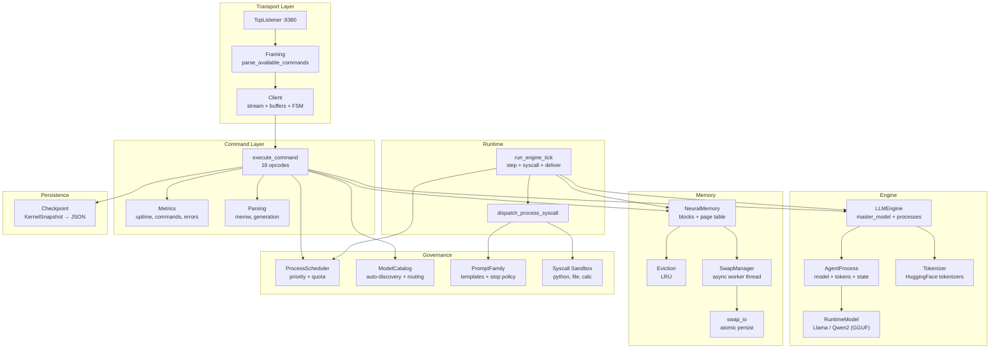
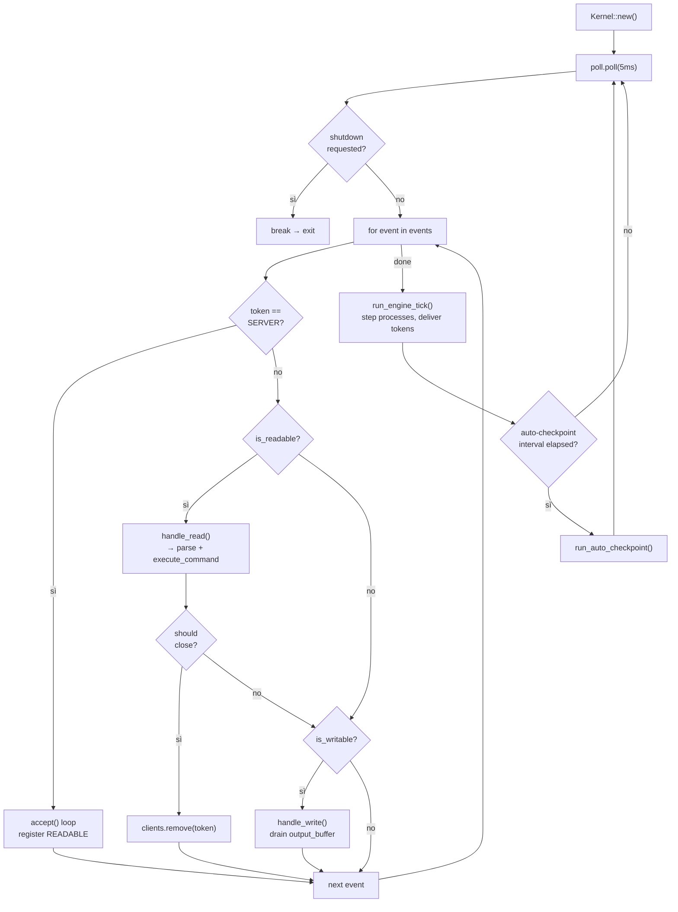
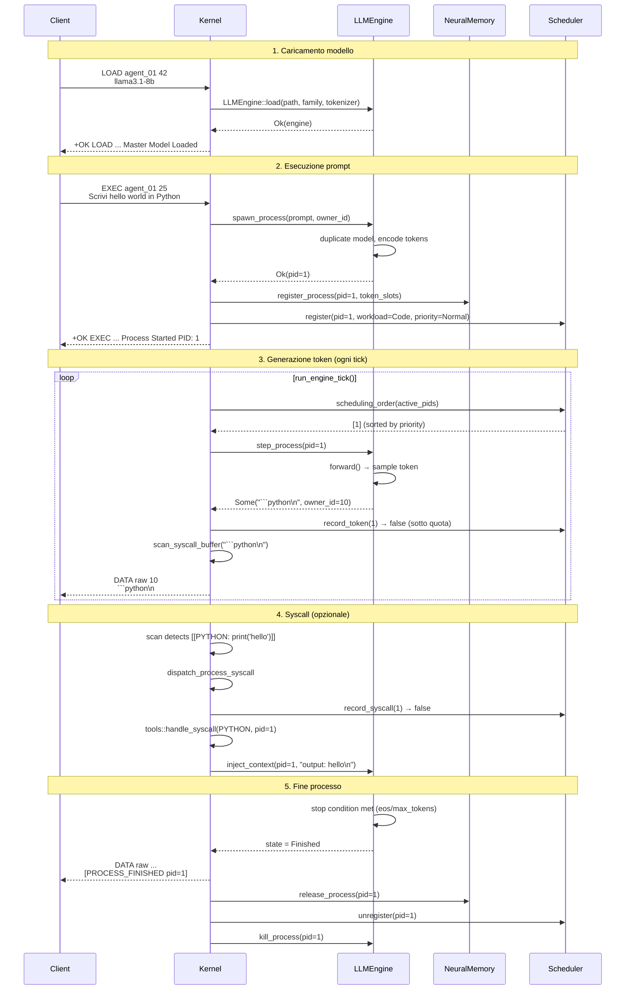
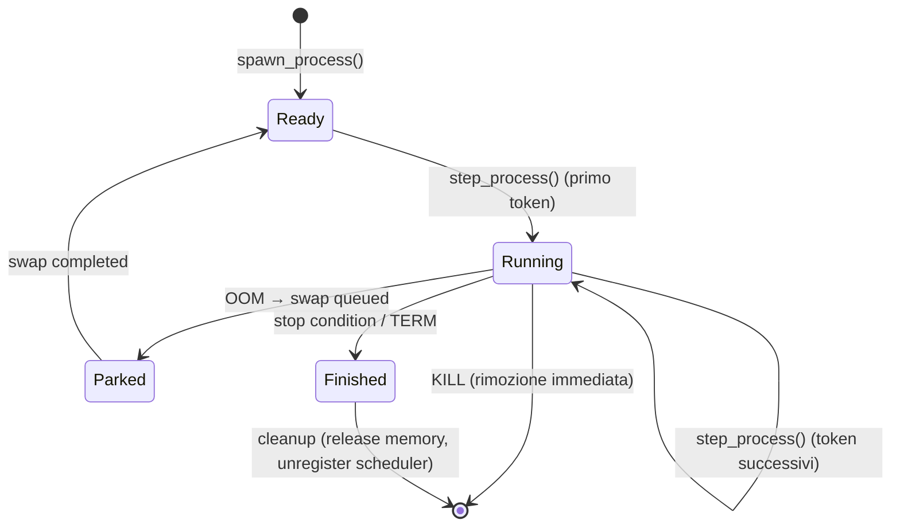
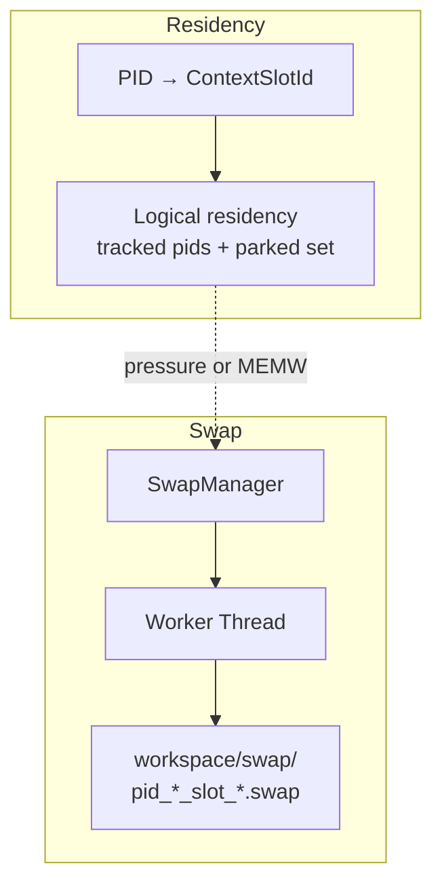
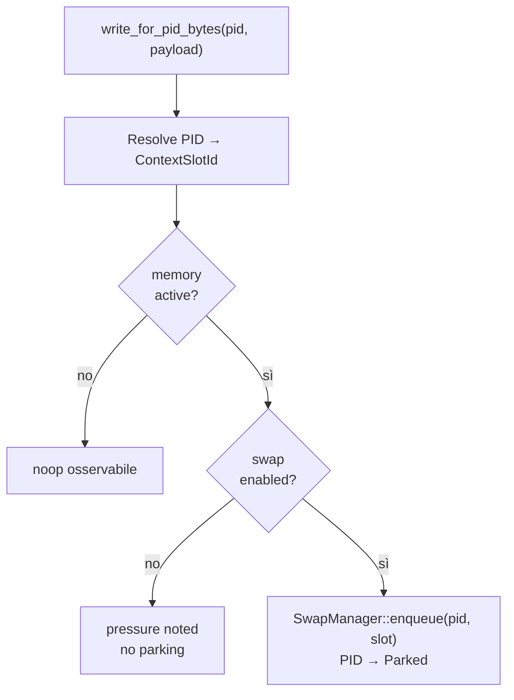
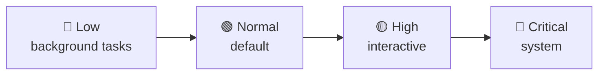
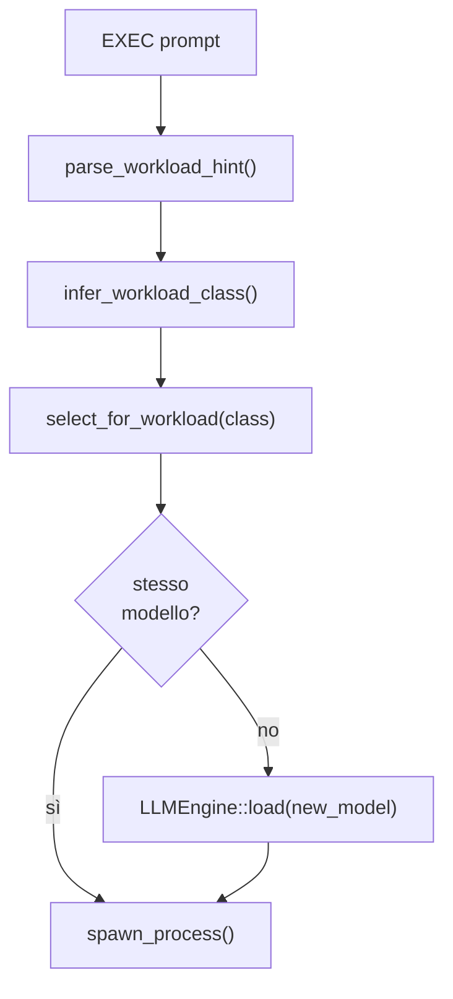

# AgenticOS — Architecture

> Versione: `0.5.0` · Aggiornamento: 2026-03-10

AgenticOS è un **AI workstation OS local-first, single-node**: un kernel per agenti LLM che espone un runtime TCP event-driven e una GUI di controllo per gestire processi autonomi basati su Large Language Model.
Ogni processo possiede un'istanza del modello, genera token in streaming, può invocare tool di sistema (syscall) e comunicare con altri processi.

La GUI primaria e' `Agent Workspace` (`apps/agent-workspace/`), una desktop app Tauri con frontend React/TypeScript e bridge Rust autenticato verso il kernel. La storica GUI PySide6 resta disponibile come fallback diagnostico `deprecated`.

Questo documento descrive l'architettura interna del kernel, i flussi end-to-end, i sottosistemi e il protocollo di comunicazione.

---

## Indice

1. [Visione d'insieme](#1-visione-dinsieme)
2. [Diagramma a blocchi](#2-diagramma-a-blocchi)
3. [Event loop e ciclo di vita](#3-event-loop-e-ciclo-di-vita)
4. [Flusso end-to-end: LOAD → EXEC → FINISHED](#4-flusso-end-to-end-load--exec--finished)
5. [Protocollo TCP](#5-protocollo-tcp)
6. [Engine e processi](#6-engine-e-processi)
7. [Memory subsystem](#7-memory-subsystem)
8. [Scheduler](#8-scheduler)
9. [Syscall sandbox](#9-syscall-sandbox)
10. [Model catalog e routing](#10-model-catalog-e-routing)
11. [Checkpoint / Restore](#11-checkpoint--restore)
12. [Configurazione](#12-configurazione)
13. [Error hierarchy](#13-error-hierarchy)
14. [Glossario](#14-glossario)

---

## 1. Visione d'insieme

```
┌─────────────────┐     TCP :6380     ┌──────────────────────────────┐
│   Client / GUI  │◄────────────────►│      AgenticOS Kernel        │
│ (Tauri, Python, │  RESP-like proto  │  (single-thread, mio 1.0)   │
│      CLI)       │                   │                              │
└─────────────────┘                   └──────────────────────────────┘
                                        │
                  ┌─────────────────────┼──────────────────────┐
                  │                     │                      │
           ┌──────▼──────┐    ┌────────▼────────┐    ┌───────▼───────┐
           │  LLMEngine  │    │  NeuralMemory   │    │  Scheduler    │
           │ resident    │    │ resident-slot   │    │  (priority +  │
           │  processes  │    │ parking/swap    │    │   quota)      │
           └──────┬──────┘    └────────┬────────┘    └───────────────┘
                  │                    │
           ┌──────▼──────┐    ┌────────▼────────┐
           │   Backend   │    │   Swap Worker   │
           │ llama.cpp   │    │   (thread)      │
           │ / cloud API │    │ slot snapshot   │
           └─────────────┘    └─────────────────┘
```

**Caratteristiche chiave:**
- **Single-thread event-driven** — il loop principale è non-blocking (`mio` epoll).
- **Local-first e single-node** — la priorita' e' correttezza e affidabilita' del runtime locale, non concorrenza forte o distribuzione.
- **Process-centric** — ogni `EXEC` crea un processo con la propria copia del modello, stato di generazione e buffer syscall.
- **Resident-slot memory** — residency manager per PID, parking asincrono e restore backend-owned dei context slot.
- **Priority scheduler** — 4 livelli di priorità (Low → Critical), quote token e syscall per workload class. Governa ordine e limiti locali; non e' un motore di parallelismo forte.
- **Syscall sandbox** — i processi LLM invocano tool (Python, file I/O, calc) tramite pattern `[[COMMAND: args]]`, con rate-limit, timeout e audit.
- **Multi-model** — catalogo auto-discovery, routing capability-aware, hot-swap tra famiglie LLM.

---

## 2. Diagramma a blocchi



---

## 3. Event loop e ciclo di vita

Il kernel è una `struct Kernel` che possiede tutto lo stato e gira in un singolo thread.



**Fasi del loop:**

1. **Poll** — epoll con timeout 5ms (non-blocking).
2. **Accept** — connessioni TCP in arrivo, registrate con interest `READABLE`.
3. **Read** — `handle_read()` legge fino a 4096 byte, `parse_available_commands()` estrae comandi dal buffer, `execute_command()` li processa. Lo stato del parser è una FSM (`WaitingForHeader` ↔ `ReadingBody`).
4. **Write** — `handle_write()` drena il `VecDeque<u8>` output buffer verso il socket.
5. **Engine tick** — `run_engine_tick()` avanza tutti i processi attivi di un passo, consegnando token e gestendo syscall.
6. **Auto-checkpoint** — se configurato, salva periodicamente lo stato su disco.

---

## 4. Flusso end-to-end: LOAD → EXEC → FINISHED



---

## 5. Protocollo TCP

### Formato header

Ogni comando è composto da un header di una riga + un payload opzionale:

```
VERB AgentID ContentLength\n
<payload bytes>
```

- **VERB** — opcode case-insensitive (18 comandi).
- **AgentID** — identificativo client (stringa, usato per tracing e compatibilita').
- **ContentLength** — lunghezza payload in byte (0 se nessun payload).

Prima di qualunque comando applicativo su una connessione fresca, il client invia `AUTH <token>` usando il valore scritto dal kernel in `workspace/.kernel_token` (bypassabile solo in sviluppo con `AGENTIC_AUTH_DISABLED=true`).

### Formato risposta

```
+OK CODE PayloadLength\r\n<payload>     ← successo
-ERR CODE PayloadLength\r\n<payload>    ← errore
DATA raw Length\r\n<binary>             ← streaming token data
```

### Tabella opcodes completa

| Opcode | Wire | Payload | Risposta | Descrizione |
|--------|------|---------|----------|-------------|
| `Ping` | `PING` | — | `+OK PING 4 PONG` | Health check |
| `Load` | `LOAD` | model selector | `+OK LOAD ...` | Carica modello GGUF in memoria |
| `Exec` | `EXEC` | prompt text | `+OK EXEC ... PID: N` | Spawna processo, genera token streaming |
| `Kill` | `KILL` | PID | `+OK KILL ...` | Termina processo immediatamente |
| `Term` | `TERM` | PID | `+OK TERM ...` | Terminazione graceful (state → Finished) |
| `Status` | `STATUS` | — oppure PID | `+OK STATUS ...` | Stato globale kernel oppure singolo PID |
| `Shutdown` | `SHUTDOWN` | — | `+OK SHUTDOWN ...` | Richiede shutdown graceful del kernel |
| `MemoryWrite` | `MEMW` | `pid\ndata` | `+OK MEMW ...` | Scrivi payload raw per PID; backend attuale richiede body allineato a 4 byte (`f32`) |
| `ListModels` | `LIST_MODELS` | — | `+OK LIST_MODELS ...` | Lista modelli disponibili (JSON strutturato) |
| `SelectModel` | `SELECT_MODEL` | model_id | `+OK SELECT_MODEL ...` | Seleziona modello di default |
| `ModelInfo` | `MODEL_INFO` | model_id (opz.) | `+OK MODEL_INFO ...` | Info dettagliate modello (JSON strutturato) |
| `SetGen` | `SET_GEN` | `key=val,...` | `+OK SET_GEN ...` | Configura parametri generazione |
| `GetGen` | `GET_GEN` | — | `+OK GET_GEN ...` | Legge parametri generazione correnti |
| `SetPriority` | `SET_PRIORITY` | `PID level` | `+OK SET_PRIORITY ...` | Imposta priorità processo |
| `GetQuota` | `GET_QUOTA` | PID | `+OK GET_QUOTA ...` | Legge quota/accounting processo |
| `SetQuota` | `SET_QUOTA` | `PID max_tokens=N,...` | `+OK SET_QUOTA ...` | Modifica quote di un processo |
| `Checkpoint` | `CHECKPOINT` | path (opz.) | `+OK CHECKPOINT ...` | Salva snapshot kernel su disco |
| `Restore` | `RESTORE` | path (opz.) | `+OK RESTORE ...` | Reapplica metadata restore-able (`metadata_only_clear_and_apply`) |

### Esempio sessione

```
→ PING agent_01 0
← +OK PING 4\r\nPONG

→ LOAD agent_01 10\nllama3.1-8b
← +OK LOAD 68\r\nMaster Model Loaded. family=Llama path=models/llama3.1-8b/...

→ EXEC agent_01 13\nHello, world!
← +OK EXEC 48\r\nProcess Started PID: 1 workload=General priority=normal
← DATA raw 5\r\nHello
← DATA raw 7\r\n, world
← DATA raw 66\r\n[PROCESS_FINISHED pid=1 tokens_generated=128 elapsed_secs=18.4]
```

---

## 6. Engine e processi

### LLMEngine

`LLMEngine` è il cuore dell'inferenza. Possiede il modello master e gestisce N processi concorrenti.

```
LLMEngine
├── master_model: Option<RuntimeModel>    # Pesi GGUF caricati tramite driver risolto
├── tokenizer: Tokenizer                  # HuggingFace tokenizer
├── device: Device                        # Sempre CPU
├── processes: HashMap<u64, AgentProcess> # Processi attivi
├── generation: GenerationConfig          # Parametri di sampling globali
├── family: PromptFamily                  # Famiglia prompt derivata dal backend/modello attivo
└── eos/eot_token_id                      # Token di stop
```

### AgentProcess

Ogni processo ha il proprio stato autonomo:

```
AgentProcess
├── id: u64                     # PID univoco
├── owner_id: usize             # Socket token del client proprietario
├── state: ProcessState         # Ready → Running → Finished
├── model: RuntimeModel         # Copia/istanza del backend risolto
├── logits_processor            # Sampler (seed = base_seed + pid)
├── tokens: Vec<u32>            # Buffer token (prompt + generati)
├── index_pos: usize            # Posizione corrente nella sequenza
├── max_tokens: usize           # Limite token massimi
├── syscall_buffer: String      # Accumulo output per detection [[...]]
├── context_policy              # Strategia per-PID (`sliding_window`/`summarize`/`retrieve`)
└── context_state               # Ledger segmenti, compaction stats, retrieval hits, episodic store
```

### Context window management per PID

Ogni `AgentProcess` possiede ora una policy di contesto first-class, indipendente dal solo prompt iniziale. Il kernel supporta tre strategie additive:

- `sliding_window` — scarta segmenti completi piu' vecchi e resetta coerentemente il context slot backend.
- `summarize` — sostituisce blocchi storici con un segmento `Summary` tramite compaction event non bloccante.
- `retrieve` — archivia segmenti storici in uno store episodico serializzabile e reinietta top-k prima del prossimo step, con ranking ibrido lessicale+recency.

La policy puo' arrivare da `EXEC` oppure dal payload `ORCHESTRATE` per-task (`context_strategy`, `context_window_size`, `context_trigger_tokens`, `context_target_tokens`, `context_retrieve_top_k`). Tutte le metriche risultanti sono osservabili via `STATUS` globale, per-PID e `STATUS orch:N`.

### Ciclo di vita di un processo



### Stop conditions

La generazione si ferma quando:
1. Token generato = `eos_token_id` o `eot_token_id` o token ID 2
2. Conteggio token ≥ `max_tokens`
3. Testo contiene marker di stop specifici per famiglia (`<|eot_id|>`, `<|im_end|>`, `</s>`, `]]`)
4. Quota scheduler esaurita (`record_token()` → force kill)

### Duplicazione modello

- **Resident local** — il kernel duplica l'adapter backend, non i pesi del modello.
- **Save/restore** — la continuità di processo dipende dai context slot residenti, non dal clone in-process dei tensori.
- **Architetture future** — il control plane deve sempre risolvere un driver compatibile con `general.architecture` prima del load.

---

## 7. Memory subsystem

Il sottosistema memoria è ora un residency manager orientato ai backend `resident_local`.

### Architettura



### Configurazione (default)

| Parametro | Valore | Significato |
|-----------|--------|-------------|
| `swap_async` | `true` | Abilita il parking asincrono dei resident slot |
| `swap_dir` | `workspace/swap` | Directory degli snapshot slot backend-owned |
| `token_slot_quota_per_pid` | `4096` | Quota logica per PID usata dall'admission control |

### Flusso `MEMW`



### Swap asincrono

Un worker thread dedicato (`agentic_swap_worker`) gestisce il parking dei resident slot:

1. Il main thread invia un `SwapJob { pid, slot_id, backend_id }` via channel.
2. Il PID viene marcato `Parked`.
3. Il worker chiama `save_context_slot()` sul backend residente e usa il path come handle di snapshot.
4. Il worker invia `SwapResult` indietro via channel.
5. Nel successivo `run_engine_tick()`, `poll_swap_events()` drena i risultati e risveglia i processi.

---

## 8. Scheduler

### Priority ordering



In ogni engine tick, i processi attivi sono ordinati per priorità decrescente. A parità, il PID più basso viene servito prima (FIFO).
Questo scheduler governa **chi viene servito per primo** e **quanto puo' consumare**, ma non introduce parallelismo di esecuzione oltre al worker dedicato per l'inferenza.

### Quota enforcement

Ogni processo riceve quote basate sulla `WorkloadClass`:

| WorkloadClass | max_tokens | max_syscalls | Uso tipico |
|---------------|------------|--------------|------------|
| `Fast` | 512 | 2 | Risposte brevi |
| `General` | 2048 | 8 | Task generici |
| `Code` | 4096 | 16 | Generazione codice |
| `Reasoning` | 8192 | 8 | Ragionamento lungo |

**Enforcement:**
- `record_token(pid)` → se quota superata, il processo viene **force-killed** nel tick.
- `record_syscall(pid)` → se quota superata, il processo viene **force-killed** immediatamente.
- Le quote sono modificabili a runtime via `SET_QUOTA`.

### Ciclo nel runtime

```mermaid
flowchart LR
    PIDS["active_pids"] --> ORDER["scheduling_order()<br/>sort by priority desc"]
    ORDER --> STEP["step_process(pid)"]
    STEP --> TOKEN["record_token(pid)"]
    TOKEN --> CHECK{quota<br/>exceeded?}
    CHECK -->|sì| KILL["force kill process"]
    CHECK -->|no| SCAN["check syscall buffer"]
    SCAN --> SYSCALL{found<br/>[[...]]?}
    SYSCALL -->|sì| DISPATCH["dispatch_process_syscall"]
    DISPATCH --> RSYS["record_syscall(pid)"]
    RSYS --> SCHECK{quota<br/>exceeded?}
    SCHECK -->|sì| KILL
    SCHECK -->|no| DELIVER["deliver token to client"]
    SYSCALL -->|no| DELIVER
```

---

## 9. Syscall sandbox

Quando un processo genera testo contenente il pattern `[[COMMAND: args]]`, il kernel intercetta il comando e lo esegue in un ambiente sandboxed.

### Comandi supportati

| Syscall | Pattern | Descrizione |
|---------|---------|-------------|
| Python | `[[PYTHON: code]]` | Esegue script Python (host/container) |
| Write file | `[[WRITE_FILE: path\|content]]` | Scrive file in workspace |
| Read file | `[[READ_FILE: path]]` | Legge file da workspace (max 1MB) |
| List dir | `[[LS]]` | Lista contenuto workspace |
| Calculator | `[[CALC: expr]]` | Valuta espressione matematica via Python |
| Spawn | `[[SPAWN: prompt]]` | Crea sotto-processo LLM |
| Send | `[[SEND: pid \| message]]` | Invio messaggio inter-processo |

### Modalità sandbox

| Modalità | Isolamento | Configurazione |
|----------|-----------|----------------|
| `Host` | Nessuno (esecuzione diretta) | Default, `AGENTIC_SANDBOX_MODE=host` |
| `Container` | Docker (`--network none`, `-m 256m`, `--cpus 1`) | `AGENTIC_SANDBOX_MODE=container` |
| `Wasm` | Stub (fallback a host se abilitato) | `AGENTIC_SANDBOX_MODE=wasm` |

### Sicurezza

- **Path traversal protection** — tutti i path normalizzati, rifiutati se escono da `./workspace/`.
- **Rate limiting** — sliding window per PID (`max_calls_per_window` in `window_s` secondi).
- **Error burst kill** — se un processo accumula N errori consecutivi, viene terminato.
- **Timeout** — ogni esecuzione ha un timeout configurabile (default 8s).
- **Audit log** — ogni syscall viene registrato in `workspace/syscall_audit.log`.

---

## 10. Model catalog e routing

### Auto-discovery

All'avvio, `ModelCatalog::discover("models/")` scansiona ricorsivamente la directory e registra tutti i file `.gguf`.
Per ogni modello il catalogo cerca il `tokenizer.json` associato, legge i metadata nativi da GGUF/tokenizer quando disponibili e conserva sia la `family` logica sia l'`architecture` reale dichiarata dal file (`general.architecture`).

```
models/
├── llama3.1-8b/
│   ├── Meta-Llama-3.1-8B-Instruct-Q4_K_M.gguf  → family=Llama, architecture=llama
│   └── tokenizer.json
├── qwen2.5-14b/
│   ├── qwen2.5-14b-instruct-q4_k_m.gguf         → family=Qwen, architecture=qwen2
│   └── tokenizer.json
└── qwen3.5-9b/
    ├── Qwen3.5-9B-Q4_K_M.gguf                   → family=Qwen, architecture=qwen35
    └── tokenizer.json
```

### Driver resolution contract

Il control plane risolve un `ResolvedModelTarget` composto da path, family, tokenizer hint, metadata e driver resolution. La scelta del driver usa due livelli:

1. `family` per la compatibilita' logica del modello.
2. `architecture` per evitare fallback falsi-positivi verso loader interni incompatibili.

Questo significa che un modello `Qwen` con `general.architecture=qwen35` viene scoperto e descritto correttamente dal catalogo, ma non viene inoltrato automaticamente a un backend incompatibile. Se nessun driver registrato supporta quell'architettura, `LOAD` fallisce prima del backend load con errore esplicito e machine-readable.

### Capability routing

Quando `AGENTIC_EXEC_AUTO_SWITCH=true` oppure il prompt contiene un hint `capability=<class>;`, il kernel può cambiare modello al volo:



**Preferenze routing per workload:**

| WorkloadClass | Preferenza famiglie | Criterio dimensione |
|---------------|--------------------|--------------------|
| `Fast` | Llama > Qwen > Mistral | Modello più piccolo |
| `Code` | Qwen > Llama > Mistral | Modello più grande |
| `Reasoning` | Qwen > Llama > Mistral | Modello più grande |
| `General` | Llama > Qwen > Mistral | Modello più piccolo |

---

## 11. Checkpoint / Restore

Il kernel può salvare un'istantanea del proprio stato su disco per resilienza ai crash.

### Contenuto del checkpoint

```json
{
  "timestamp": "epoch_1709600000",
  "version": "0.5.0",
  "active_family": "Llama",
  "selected_model": "llama3.1-8b",
  "generation": { "temperature": 0.7, "top_p": 0.9, "seed": 42, "max_tokens": 256 },
  "processes": [
        {
            "pid": 1,
            "owner_id": 10,
            "state": "Running",
            "token_count": 128,
            "max_tokens": 256,
            "context_policy": { "strategy": "retrieve", "window_size_tokens": 512, "compaction_trigger_tokens": 448, "compaction_target_tokens": 384, "retrieve_top_k": 3 },
            "context_state": { "tokens_used": 128, "context_compressions": 2, "context_retrieval_hits": 4, "last_compaction_reason": "retrieve_archived_segments=2 archived_tokens=36 retrieval_hits=2", "last_summary_ts": null, "segments": [], "episodic_segments": [] }
        }
  ],
  "scheduler": {
    "entries": [
      { "pid": 1, "priority": "high", "workload": "Code", "max_tokens": 4096, ... }
    ]
  },
  "metrics": { "uptime_secs": 3600, "total_commands": 42, ... },
  "memory": { "active": true, "total_blocks": 1024, "free_blocks": 800, ... }
}
```

### Cosa viene salvato e cosa no

| Salvato (metadati) | NON salvato |
|--------------------|-------------|
| Lista processi (PID, stato, owner) | Pesi del modello (GGUF in RAM) |
| Scheduler (priorità, quote, accounting) | Token buffer dei processi |
| Metriche aggregate | Tensori in NeuralMemory |
| Configurazione generazione | Connessioni TCP |
| Modello selezionato | Output buffer dei client |

**Al restore:** il kernel richiede stato idle, azzera la porzione restore-able gia' presente e riapplica lo snapshot in modalita' `metadata_only_clear_and_apply`. Scheduler entries, selected model hint, generation config e metadata di context policy/state vengono ripristinati; processi live, pesi, tensori e output buffer non vengono mai ripresi.

### Auto-checkpoint

Se `AGENTIC_CHECKPOINT_INTERVAL_SECS > 0`, il kernel salva automaticamente ogni N secondi. La write è atomica (temp file + rename) e best-effort (errori loggati, mai fatali).

---

## 12. Configurazione

La configurazione primaria vive in `agenticos.toml`, con override opzionali via variabili d'ambiente.

| Variabile | Default | Descrizione |
|-----------|---------|-------------|
| `RUST_LOG` | `info` | Livello di log (tracing) |
| `AGENTIC_LOG_CONNECTIONS` | `false` | Log connessioni TCP |
| `AGENTIC_MEMORY_SWAP_ASYNC` | `true` | Abilita swap asincrono su disco |
| `AGENTIC_MEMORY_SWAP_DIR` | `workspace/swap` | Directory per file di swap |
| `AGENTIC_CHECKPOINT_INTERVAL_SECS` | `0` (off) | Intervallo auto-checkpoint in secondi |
| `AGENTIC_EXEC_AUTO_SWITCH` | `false` | Auto-switch modello per workload |
| `AGENTIC_SANDBOX_MODE` | `host` | Modalità sandbox syscall |
| `AGENTIC_ALLOW_HOST_FALLBACK` | `true` | Permetti fallback a host se sandbox non disponibile |
| `AGENTIC_SYSCALL_TIMEOUT_S` | `8` | Timeout esecuzione syscall (secondi) |
| `AGENTIC_SYSCALL_MAX_PER_WINDOW` | `12` | Rate limit: max chiamate per finestra |
| `AGENTIC_SYSCALL_WINDOW_S` | `10` | Rate limit: dimensione finestra (secondi) |
| `AGENTIC_SYSCALL_ERROR_BURST_KILL` | `3` | Errori consecutivi prima del kill |

---

## 13. Error hierarchy

```mermaid
graph TD
    KE["KernelError"]
    KE --> IO["Io(std::io::Error)"]
    KE --> ME["Memory(MemoryError)"]
    KE --> EE["Engine(EngineError)"]
    KE --> PE["Protocol(ProtocolError)"]
    KE --> CE["Catalog(CatalogError)"]
    KE --> CF["Config(String)"]

    ME --> OOM["OutOfMemory"]
    ME --> QE["QuotaExceeded"]
    ME --> ZTS["ZeroTokenSlots"]
    ME --> PNR["PidNotRegistered"]
    ME --> TNF["TensorNotFound"]
    ME --> SW["Swap(String)"]
    ME --> AL["Alloc(String)"]

    PE --> EH["EmptyHeader"]
    PE --> IHF["InvalidHeaderFormat"]
    PE --> UO["UnknownOpcode"]
    PE --> ICL["InvalidContentLength"]

    CE --> MNF["ModelNotFound"]
    CE --> DRF["DirectoryReadFailed"]
    CE --> NMS["NoModelSelected"]
    CE --> IS["InvalidSelector"]
    CE --> PNFc["PathNotFound"]
```



Tutti gli errori usano `thiserror` per derivazione automatica di `Display` e `Error`. Le risposte al client usano i codici errore (e.g., `-ERR LOAD_FAILED ...`, `-ERR PID_NOT_FOUND ...`) piuttosto che esporre i tipi Rust interni.

---

## 14. Glossario

| Termine | Significato |
|---------|-------------|
| **Kernel** | Il processo Rust principale che gestisce l'event loop, le connessioni TCP e tutti i sottosistemi |
| **Process / AgentProcess** | Un'istanza autonoma di generazione LLM con il proprio modello, stato e token buffer |
| **PID** | Identificativo univoco di un processo (u64, monotonicamente crescente) |
| **Engine (LLMEngine)** | Il gestore dei modelli e dei processi — carica GGUF, spawna processi, genera token |
| **RuntimeModel** | Wrapper enum per i backend LLM supportati (Llama, Qwen2), caricato da file GGUF quantizzati |
| **PromptFamily** | Famiglia di template prompt (Llama, Qwen, Mistral) — determina token speciali e formattazione |
| **GenerationConfig** | Parametri di sampling: temperature, top_p, seed, max_tokens |
| **NeuralMemory** | Allocatore a pagine per tensori, con LRU eviction e swap asincrono |
| **PhysicalBlock** | Un tensore Candle pre-allocato che funge da "pagina fisica" di memoria |
| **Page Table** | Mappa `TensorId → Vec<BlockIndex>` che collega tensori logici a blocchi fisici |
| **SwapManager** | Gestore dello swap asincrono — worker thread che persiste dati su disco quando la RAM è piena |
| **Scheduler (ProcessScheduler)** | Governa ordine di esecuzione (priorità) e limiti risorse (quote token/syscall) |
| **WorkloadClass** | Classificazione del tipo di task (Fast, Code, Reasoning, General) — determina quote e routing |
| **Syscall** | Invocazione di tool da parte di un processo LLM, rilevata dal pattern `[[COMMAND: ...]]` nell'output |
| **Checkpoint** | Snapshot serializzato (JSON) dello stato kernel — scheduler, processi, metriche, config |
| **OpCode** | Codice operativo del protocollo TCP — identifica il tipo di comando (PING, EXEC, STATUS, ...) |
| **ModelCatalog** | Registry dei modelli GGUF disponibili, con auto-discovery e routing capability-aware |
| **Engine Tick** | Un ciclo di `run_engine_tick()` — avanza tutti i processi di un passo, consegna output, gestisce syscall |
